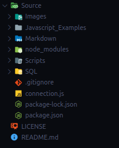

# Utilizando Node para se conectar com Banco de dados MySQL

#### Como foi iniciado o Sistema Node

1. `npm init` dentro do Diretório **Source/**
2. `npm install mysql` para baixar o Módulo do MySQL no Node

#### Módulos Instalados

Nome do Módulo|Para que serve|Comando de Instalação
|---|---|---|
mysql|Utilizar comandos do MySQL pelo Código|`npm install mysql`
cli-color|Colocar cores nas Saidas dos Console.logs|`npm install cli-color`

#### Diretórios

Nome do Diretório|Para que serve|
|---|---|
`Source`|Diretório principal onde fica a organização das Informações
`Images`|Onde ficam todas as Imagens usadas nos Arquivos Markdown
`Javascript_Examples`|Onde ficam todos os Arquivos Javascript com os exemplos de Programas
`Markdown`|Onde ficam todas as informações de cada etapa e informações sobre os programas com o Banco de Dados
`node_modules`|não vai junto para o git, onde ficam todos os módulos necessários para compilar os programas
`Scripts`|Onde ficam todos os Scripts de Linux para instalar ou deletar programas importantes
`SQL`|Onde ficam todos os arquivos SQL com exemplos de informações

#### Documentação Interna

1. [Instalando MySQL no Linux](../Node_Database_MySQL/Source/Markdown/mysql_instalation.md)
2. [Como criar uma Conexão com Banco de Dados MySQL](../Node_Database_MySQL/Source/Markdown/node_mysql.md)
3. [Como criar um Banco de Dados por Javascript](../Node_Database_MySQL/Source/Markdown/create_database.md)
4. [Como Deletar um Banco de Dados por Javascript](../Node_Database_MySQL/Source/Markdown/delete_database.md)
5. [Como Criar uma Tabela no Banco de Dados por Javascript](../Node_Database_MySQL/Source/Markdown/create_table.md)
6. [Como Deletar uma Tabela no Banco de Dados por Javascript](../Node_Database_MySQL/Source/Markdown/delete_table.md)