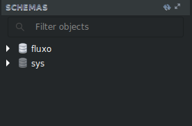

# Usando SQL para criar um Banco de Dados

* Anteriormente: [Criando Conexão MySQL](../Markdown/node_mysql.md)

### Criando um Banco de Dados

Agora que temos uma conexão com o Banco de Dados, podemos enviar comandos SQL pelo Javascript, sendo o primeiro deles o de criar um banco de dados novo, onde o comando em SQL é:

```sql
create database databaseName
```

Esse comando ele cria um Banco de Dados no MySQL com o nome _databaseName_ onde se deve mudar esse nome para o nome que você quiser como **universidade** caso esteja querendo construir um Banco de Dados de Universidade:

```sql
create database universidade
```

Agora, como enviar esse comando pelo Javascript para o MySQL? utilizamos a Função **query** do Módulo do mysql.

O básico inicial é iniciar a conexão como apresentado anteriormente:

```javascript
var mysql = require('mysql');
var connection = mysql.createConnection({
    host: "localhost",
    user: "root",
    password: "senha"
});

connection.connect(function(error){
    if(error) throw error;
    console.log("MySQL Connected!");
});
```

Agora podemos usar a Função **query** dentro da Função **connect** onde após a conexão funcionar ele vai fazer o pedido da Função **query** interna.

Então se quero construir um Banco de Dados, eu pego o comando e coloco na função query junto com uma Função interna para me dar uma Resposta pelo Terminal:

```javascript
connection.connect(function(error){
    if(error) throw error;
    console.log("MySQL Connected!");

    //Criando o Banco de Dados
    connection.query("create database test",function(error,result){
        if(error) throw error;
        console.log("Database [test] Created!");
    });
});
```

* Depois de configurar o Arquivo, nós rodamos o Programa com o seguinte comando:

```shell
> node nomeArquivo.js
```

* Se for abrir o MySQL Workbench antes e depois você vai ver que foi criado um novo **Schema** bem na Esquerda abaixo, onde é o nosso Banco de Dados.

* **Antes**



* **Depois**


* O Arquivo com o Exemplo Completo se encontra [AQUI](../Javascript_Examples/create_database.js)

 