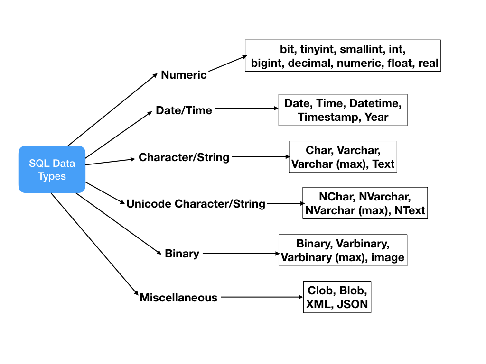
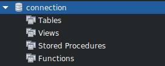
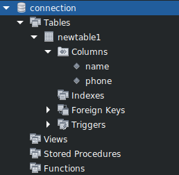

# Como criar uma Tabela em um Banco de Dados

* Anteriormente:
  * [Configurando o MySQL no Javascript](../../Source/Markdown/node_mysql.md)
  * [Criando um Banco de Dados pelo Javascript](../../Source/Markdown/create_database.md)

### Definindo o Banco de dados

Agora que sabemos como configurar o MySQL no Node.js e temos um Banco de Dados criado, devemos dizer para o nosso programa qual banco de dados queremos interagir, adicionando mais uma informação na Função **createConnection**:

```javascript
var connection = mysql.createConnection({
    host: "localhost",
    user: "root",
    password: "senha",
    database: "connection" //definindo o banco de dados
});
```

### Como criar uma Tabela nova

Primeiro, devemos entender quais tipos de dados podemos usar nas **Colunas** da nossa Tabela, como mostra a imagem abaixo:



Mas o principal é:

* **varchar** = para Strings
* **int** = para inteiros
* **float** = para com ponto flutuante
* **Date** = para Datas

Também definimos o tamanho, onde esse tamanho é o númeroo de digitos ou caracteres se pode colocar ali:

* **varchar(5)** = exemplo: "Tempo"
* **int(5)** = exemplo: "12345"

O comando em SQL de criar uma tabela com duas Colunas é:

```sql
create table newtable1 (nome varchar(120), phone int(10))
```

Dessa forma, tendo como definido qual o Banco de Dados que iremos colocar a tabela e suas colunas, somente utilizamos a Função **query** para usarmos o comando SQL

```javascript
connection.connect(function(error){
    if(error) throw error;
    console.log(color.green("MySQL Connected!"));

    // Criando uma Tabela nova no Banco de Dados
    var command = "create table newtable1 (nome varchar(255), phone int(30))"
    connection.query(command, function(error,result){
        if(error) throw error;
        console.log(color.blue("Table [newtable1] Created!"));
    });
});
```

No MySQL Workbench vai poder ser visto visualmente:

* **Antes**



* **Depois**



* O Programa Completo você encontra [AQUI](../../Source/Javascript_Examples/create_table.js)