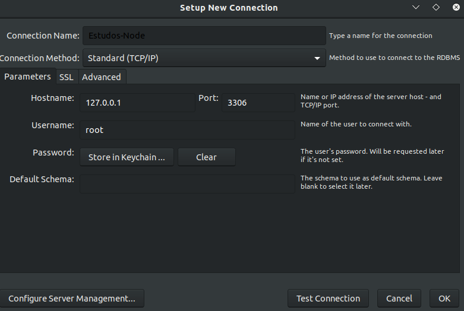
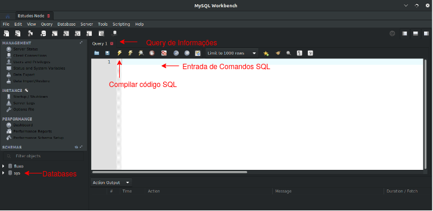

# Instalando MySQL e Configurando o Sistema

### Removendo todo o MySQL quando necessário

```shell
> sudo apt-get remove --purge *mysql\*
> sudo apt-get autoremove
> sudo apt-get autoclean
```

### Instalando o MySQL no Linux

* Comandos para instalar o core do MySQL

```shell
> sudo apt update
> sudo apt install mysql-server mysql-client
```

* Comando para testar se o MySQL está instalado e Rodando

```shell
> service mysql status
```

### Configurando o seu MySQL

* Acesse o MySQL pelo terminal com permissões de Root

```shell
> sudo mysql -u root -p
```
* **OBS**: clique em <kbd>Enter</kbd> sem senha

* Altere sua senha com o seguinte comando no Terminal, depois de acessado o MySQL

```sql
> ALTER USER 'root'@'localhost' IDENTIFIED WITH mysql_native_password BY 'suasenha';
```

* **OBS**: _suasenha_ no final é a senha desejada para o usuário Root no MySQL

### Utilizando o MySQL Workbench

* MySQL Workbench é um Editor e Visualizador de Banco de Dados do MySQL

**Criando Nova Conexão**

* Abra o MySQL Workbench e clique no _+_ que aparece encima das Conexões existentes:


* Agora iremos definir informações necessárias para a Conexão, como abaixo:



Informação|Para que serve
|---|---|
Connection Name| Nome da Conexão
Connection Method| O normal é Standard(TCP/IP)
Hostname|127.0.0.1 é o **Localhost**, ou seja, somente vai ser um Banco de Dados interno.
Port|Porta da Conexão, normalmente é 3306
Username| é o usuário Root que acessa o Banco de Dados
Password| Senha definida quando foi alterado a senha do Usuário Root
Default Schema| Seria o Schema padrão daquela conexão, deixando em Branco pode ser Definido qualquer Schema depois

**Acessando Nova Conexão**

* Após iniciado a Conexão podemos ver a seguinte tela:

