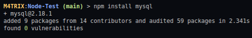

# Como criar uma Conexão com Banco de Dados MySQL

Primeira coisa que devemos fazer é instalar o Módulo do MySQL no nosso projeto com Node

```shell
# Use esse comando dentro do Diretório onde possui package.json
> npm install mysql
```

Deve dar o seguinte resultado pelo terminal:



### Importando o Módulo do MySQL

Agora que temos instalado o Módulo do MySQL no Projeto, devemos chamar o Módulo para o nosso Arquivo Javascript, utilizando a Função **require** do Javascript.

```javascript
var mysql = require('mysql');
```

### Criando uma Conexão com o MySQL

Para podermos interagir com o MySQL pelo Javascript precisamos criar uma conexão utilizando o Módulo do mysql, passando as seguintes informações:

* **host**: Nome do host do MySQL, normalmente _localhost_
* **user**: Usuário que vai acessar o banco de dadosm normalmente é o _root_
* **senha**: A senha de Acesso ao Sistema do MySQL, configurado para o usuário do Root

Para fazermos essa Conexão, devemos criar uma Variável que vai fazer essa conexão, onde é com essa variável que iremos utilizar o comando mais immportante, chamado _query_, mas isso é para depois

```javascript
var connection = mysql.createConnection({
    host: "localhost",
    user: "root",
    password: "senha"
});
```

### Conectando ao MySQL

Agora que temos a conexão definida, iremos conectar ao MySQL pelo arquivo Javascript, utilizando a Função **connect**, onde iremos adicionar uma Função para responder pelo terminal que estamos conectados ao MySQL ou Não.

```javascript
connection.connect(function(error){
    if(error) throw error;
    console.log("MySQL Connected!");
});
```

### Código Completo

Agora temos uma Conexão simples com o MySQL pelo Javascript.

```javascript
// Import do Módulo do MySQL
var mysql = require('mysql');

// Criando a Conexão com o MySQL
var connection = mysql.createConnection({
    host: "localhost",
    user: "root",
    password: "senha"
});

// Conectando ao Banco de Dados
connection.connect(function(error){
    if(error) throw error;
    console.log("MySQL Connected!");
});
```